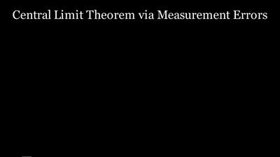

# NIMA — AI Manim Generator

[](./LICENSE)
[](https://www.python.org/downloads/)
[](https://www.manim.community/)

Turn a natural-language prompt into a rendered [Manim CE](https://www.manim.community/) animation.

NIMA is a Flask + Next.js system that runs an LLM-driven pipeline (analyze → plan → generate → review → render), self-heals render errors, streams scene-by-scene for long videos, and muxes an edge-tts voiceover on top.



> Full narrated MP4: [example.mp4](./example.mp4)

---

## Quickstart

Prereqs: **Python 3.11+**, **[Manim CE](https://docs.manim.community/en/stable/installation.html)** (with LaTeX for math rendering), **ffmpeg**, and any OpenAI-compatible API key.

```bash
git clone https://github.com/khozhaniyazov/nima_model.git
cd nima_model
python -m pip install -r requirements.txt
cp .env.example .env          # fill in OPENAI_API_KEY at minimum
python app.py                 # Flask API on http://localhost:5000
```

> **Linux / macOS users:** NIMA's `MANIM_SCRIPTS` and `OUTPUTS` defaults are Windows paths (`C:/temp/...`). Add these to your `.env` before first run:
>
> ```
> MANIM_SCRIPTS=/tmp/manim_scripts
> OUTPUTS=/tmp/outputs
> ```
>
> Optionally pull the 3Blue1Brown RAG corpus (improves golden-example retrieval; skip for a leaner setup):
>
> ```bash
> git submodule update --init --recursive
> ```

Frontend (optional — Next.js dashboard + prompt UI):

```bash
cd nima-frontend
npm install
npm run dev                   # http://localhost:3000
```

Send a prompt:

```bash
curl -s http://localhost:5000/api/generate \
  -H 'Content-Type: application/json' \
  -d '{"prompt": "Show how Pythagoras theorem works with squares on each side"}'
```

---

## Features

- **Multi-provider LLM routing** with automatic failover + cooldowns (OpenAI + two optional compatible providers).
- **Streaming scene-by-scene mode** — render scene N in a background thread while the LLM generates scene N+1, then stitch with ffmpeg.
- **Self-healing renders** — on `manim` failure, feed stderr back to the model and retry with surgical repair hints.
- **Deterministic fallback** — every video mode (short / standard / course / lecture) has a code-generated scene template that produces a valid MP4 even if the LLM output is unusable.
- **Scene-level validation** — static layout risk detection (overlaps, off-frame text, unbounded long text), frame-quality gate (blank frames, OCR overlap), duration padding.
- **Voiceover** via edge-tts (free, no key) muxed per scene and on the final stitch.
- **RAG-backed examples** — golden examples + error patterns retrieved by domain.
- **Optional Postgres** for job/usage persistence (falls back to in-memory).
- **`NIMA_LANGUAGE_LOCK`** env var to force on-screen text + narration into a non-English language (Kazakh tested).

---

## Architecture

```
prompt ──► analyze ──► plan ──► generate ──► review ──► render ──► stitch ──► output
                                    │            │          │
                                    │            │          └─► self-heal retry
                                    │            └─► overlap / layout gate
                                    └─► scene-by-scene streaming (Phase 13)
                                          + per-scene deterministic fallback
```

Backend layout:

| Path | What lives there |
|---|---|
| `app.py` | Thin Flask factory — blueprints + background worker wiring. |
| `config.py` | Single source of env reads. Everywhere else imports from here. |
| `algorithms/` | Pipeline stages + services (generation, render, stream, webhook, job lifecycle, planning, media, RAG glue). |
| `api_routes/` | Flask blueprints: core, batches, media, templates, webhooks, api_keys, lti, payload. |
| `RAG/` | Retrieval-augmented examples + fine-tuning data. |
| `tests/` | pytest suite (~352 tests, ~5 s). |
| `scripts/` | Dev + reliability harnesses (not pytest). |
| `nima-frontend/` | Next.js dashboard and generator UI. |
| `docs/`, `.planning/` | Design notes, roadmap, phase plans. |

The streaming layer (`algorithms/streaming*.py`) is split across 7 modules after the #11 / #59 refactor: `streaming`, `streaming_orchestration`, `streaming_providers`, `streaming_prompts`, `streaming_render`, `streaming_validation`, `streaming_fallbacks`. Back-compat is preserved via re-exports and a `_s()` lazy-lookup helper — see `algorithms/streaming_orchestration.py` for the pattern.

---

## Configuration

Everything is driven by `.env` (see [`.env.example`](./.env.example) for the full list). Only `OPENAI_API_KEY` is strictly required; the rest have sensible defaults in `config.py`.

Common knobs:

| Var | Default | Meaning |
|---|---|---|
| `OPENAI_API_KEY` | (required) | OpenAI or any compatible provider |
| `GENERATION_MODEL` | `gpt-5.2-codex` | Primary code-gen model |
| `DRAFT_PIPELINE` / `FAST_PIPELINE` | `false` / `false` | Fastest / single-pass modes |
| `MAX_RENDER_RETRIES` | `3` | Self-healing retry budget per scene |
| `RENDER_TIMEOUT_SECONDS` | `900` | Hard wall on a single manim render |
| `ENABLE_VOICEOVER` | `true` | Mux edge-tts narration |
| `EDGE_TTS_VOICE` | `en-US-GuyNeural` | TTS voice (any edge-tts-supported) |
| `NIMA_LANGUAGE_LOCK` | unset | e.g. `Kazakh` to force non-English captions + TTS |
| `USE_DATABASE` + `DB_CONNECTION_STRING` | `false` | Opt-in Postgres persistence |
| `NIMA_ADMIN_TOKEN` | unset | Required to enable admin-only endpoints |

---

## Development

```bash
ruff check .
pytest tests/ -q        # 352 tests, ~5 s
```

See [CONTRIBUTING.md](./CONTRIBUTING.md) for the full workflow (branch naming, commit style, how to open a PR, how self-review works, etc.).

CI note: the repo currently runs local-checks-only (see CONTRIBUTING). `ruff check .` and `pytest tests/` are the contract — if they pass locally, the PR is ready.

---

## Known limitations

- **Windows-first defaults** — `MANIM_SCRIPTS` / `OUTPUTS` default to `C:/temp/...`. Override via `.env` on Linux/macOS (e.g. `MANIM_SCRIPTS=/tmp/manim_scripts`, `OUTPUTS=/tmp/outputs`).
- **LTI 1.3 is feature-flagged off by default** (`NIMA_LTI_ENABLED=false`). The blueprint was gated behind the flag in PR #55 precisely because real `id_token` signature verification (JWKS fetch + `iss`/`aud`/`exp`/nonce enforcement) is not yet implemented — do NOT enable in production.
- **Standard-mode partial-deliverable semantics** — when the final stitched video trips the aesthetic QA gate (resolution of #19 in PR #23), the pipeline ships the render with `partial=true` and a `final_quality_reason` rather than erroring. Clients that treat `partial=true` as a hard failure will see what looks like a regression; it's actually "here's a usable-but-flagged video."
- **`GENERATION_MODEL` default (`gpt-5.2-codex`)** may not resolve on stock `api.openai.com`. Override in `.env` to match whatever your provider exposes (e.g. `GENERATION_MODEL=gpt-4o` for vanilla OpenAI).
- **3Blue1Brown RAG corpus is an opt-in submodule** under `training/3b1b/videos/` (CC BY-NC-SA 4.0). Not populated by default — run `git submodule update --init --recursive` if you want the full retrieval pool. NIMA runs without it. See [`NOTICE`](./NOTICE).

---

## License

[Apache License 2.0](./LICENSE) © 2026 Zhanserik Khozhaniyazov.

The Apache-2.0 grant covers NIMA's own source code. Vendored third-party content (notably the 3Blue1Brown corpus under `training/3b1b/videos/` and the agentic-coding skill bundles under `skills/`) retains upstream licensing — see [`NOTICE`](./NOTICE) for attribution and terms. External services referenced (OpenAI, Claude, zjuapi, wenwen, edge-tts voices) are governed by their own terms.

---

## Acknowledgements

Built on top of [Manim Community Edition](https://www.manim.community/), [edge-tts](https://github.com/rany2/edge-tts), and the usual suspects (Flask, Next.js, ffmpeg, Pillow for optional vision adapters).
